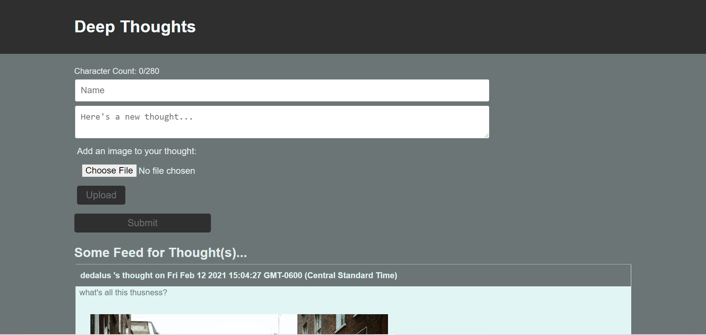
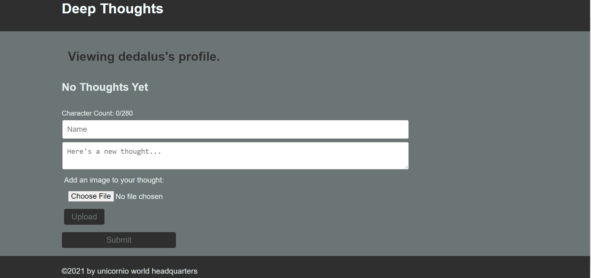
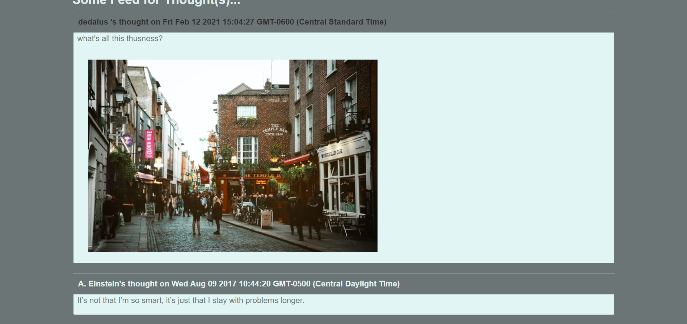

# AWS THOUGHT


## Description
A social media application that allows users to create an account, share thoughts in posts, and upload images with those posts.  Built with React and Node with Amazon Web Service's S3 buckets for storing image uploads, DynamoDB for database management and EC2 for deployment.

##### Homescreen

##### Profile View

##### Feed View


Visit site [here](http://3.12.166.143/)

## Table of Contents
  * [Installation](#installation)
  * [Usage](#usage)
  * [License](#license)
  * [Technologies](#technologies)
  * [Contributing](#contributing)
  * [Testing](#testing)
  * [Questions](#questions)
  
## Installation
Clone project to a directory on your local machine and cd into aws-thoughts directory. 
Run 
```
npm install
```
to install dependencies

Follow instructions [here](https://us-east-2.console.aws.amazon.com/console/home?region=us-east-2#) to create S3 bucket, DynamoDB service, and EC2 instance.

Create .env file in root of project and add your IAM user credentials.

## Usage
Run <$ npm start> to launch application on localhost development server, port 3000

## License 
This project is covered under the MIT license 

## Technologies 
HTML5, CSS3, React, Node.js, Express, AWS S3, DynamoDB, EC2 

## Questions
Visit me at GitHub  
[christopherConcannon](https://github.com/christopherConcannon)
  
If you have any questions or would like to contact me, please email me at  
[cmcon@yahoo.com](mailto:cmcon@yahoo.com)
